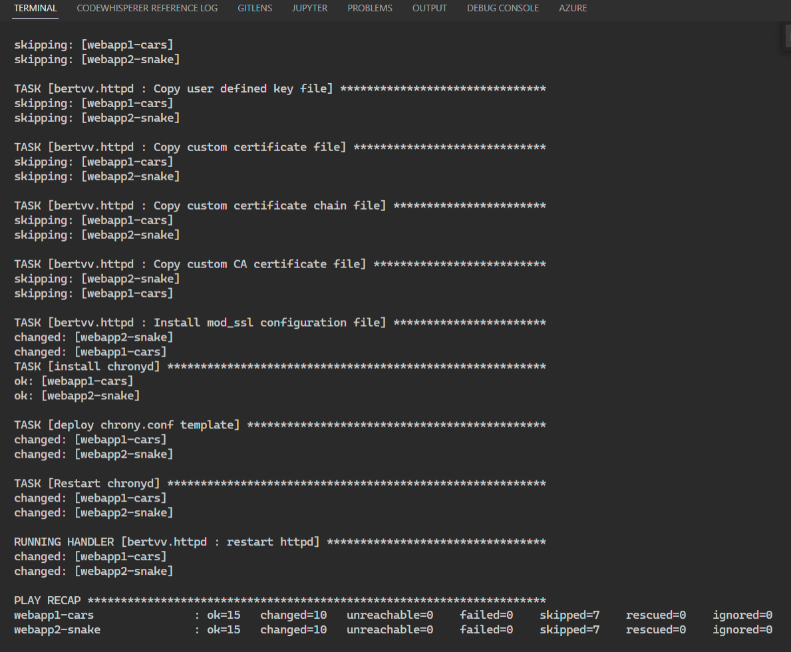
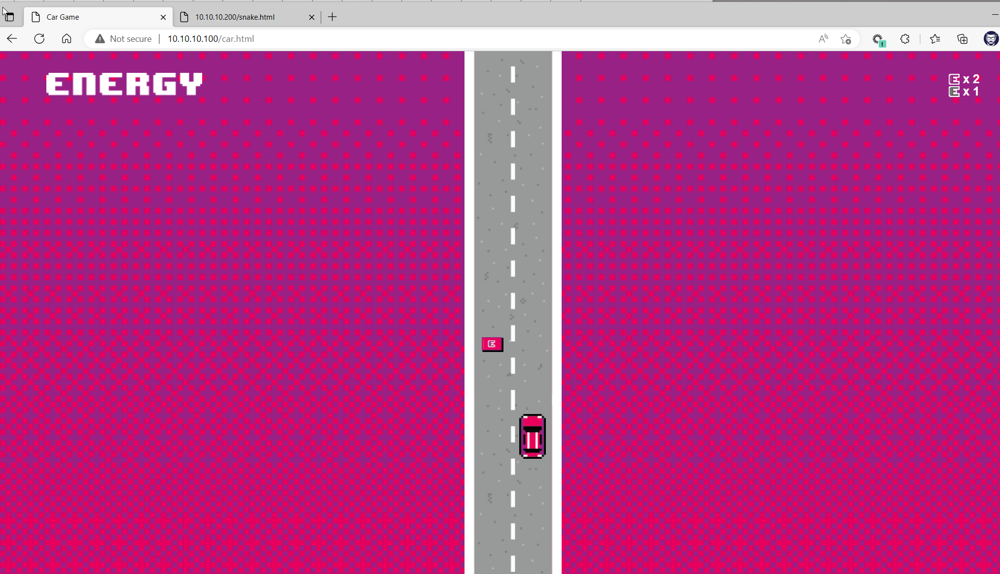
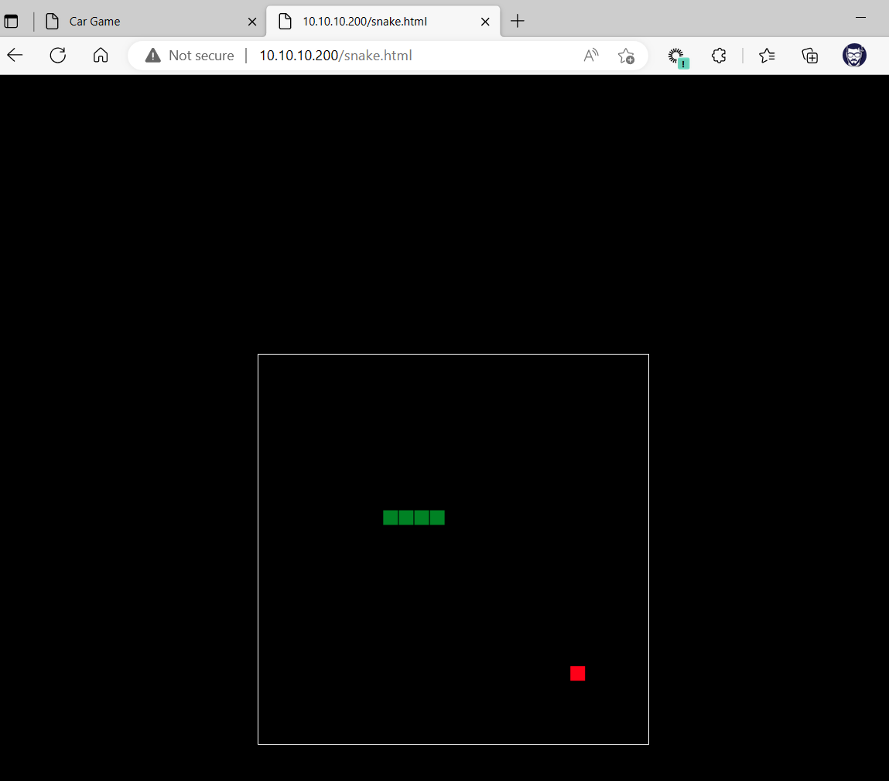

# Ansible Technical Challenge

Hi there, welcome to our git repo for a basic ansible skills test for a position in our technical team.

While this test is somewhat farcical, the objective is to get a sense of your ansible skills by having you deploy some infrastructure with some static content hosted on it. We'd like you to fork our git repository, add your submission and send a link for us to clone it on completion. We'll then test it out in our lab and marvel at your good work. The expectation is that this should take no more than a few hours to complete (no need to boil the ocean).

If you have any questions, or anything in the challenge is not clear, please reach out to us so that we can promptly provide clarification.

## Scope of the test:

The website https://onehtmlpagechallenge.com/ has a selection of little projects each in a single html file. We'd like you to choose a minimum of two of them and:

- Use Ansible deploy a minimum of two virtual machines on the cloud or hypervisor of your choice (public cloud preferred, however if you have a lab using VMware, KVM etc that's absolutely fine).
- The virtual machines should have httpd installed and each host a different html file for example:
	- Virtual Machine #1 hosts html file with the car game and Virtual Machine #2 hosts the html file with the snake game.
	- Both Virtual machines should be deployed together along with the associated software installation and configuration.
- Any required VPCs, network security groups, SSH key pairs etc should be included as part of your infrastructure deployment.
- Add some basic configuration management to the systems you deploy (e.g. chrony, timezone, SSH hardening, installing packages that you find useful and should be in a Linux SOE).
- Think about security hardening of the infrastructure and operating systems you deploy. Additionally securing the webservices with SSL. Self-signed certs are fine.
- Your playbooks/roles should be idempotent and pass ansible-lint.
- Ideally you will use a dynamic inventory as part of your submission.
- Using content from ansible-galaxy is fine, however we'd like to see your work rather than making efficient use of community provided content.
- Don't overthink or over-engineer it, however we'd like to see effective use of loops/variables/logic in your submission.
- How you lay out the playbooks/tasks/roles is up to you. There is a basic structure in this repository to get you started.

Essentially the way we will be testing this is by doing the following:

```
ansible-lint site.yml
ansible-galaxy collection install -r collections/requirements.yml
ansible-playbook -i inventory/<your dynamic inventory script> site.yml
```

## Submission Criteria:

- There should not be any manual steps, we should be able to clone your repository and run your site.yml to deploy everything in one shot.
- Any pre-requisites should be documented clearly.
- Use the Linux distribution of your choice, however one of Fedora/CentOS/RHEL is preferred.
- There should be no passwords or keypairs etc in your repository. Anything sensitive you have in there should be protected with ansible vault at a minimum.

## Bonus Points:

- Add a second non-compliant submission where you would show us how you'd host this content in something other than a VM hosting a single file (e.g. containers or something cloud-native)
- Consider if you should choose the insult generator one or not (we dare you) :)

## Solution with Test Evidence:
Run `vagrant up --provision`




